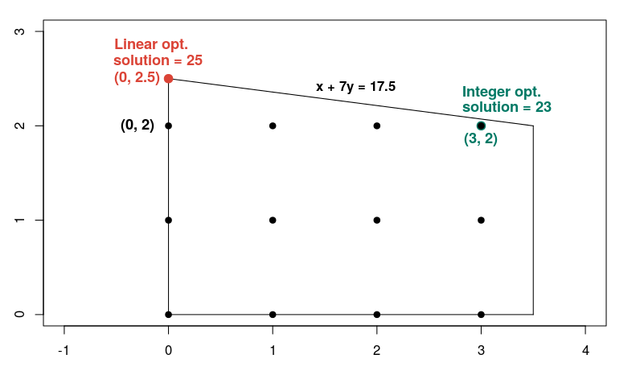

```{r setup, , echo=FALSE, message= FALSE}
rootFolder <- Sys.getenv("MEETUP")
source(paste0(rootFolder, "scripts/Charts.R"))
library(tidyverse)
library(plotly)
library(widgetframe)
library(broom)
library(gt)

```

```{css, echo = FALSE}
.large .remark-code { font-size: 130% }
.small .remark-code { font-size: 70% }
.tiny .remark-code { font-size: 50% }
```

---

class: inverse, middle

# Git

- You should consider version control if you collaborate with others or want to secure your work
- If greenfield project, you should choose Git
- Very easy to create account at e.g. GitHub, where you can store repos.
- Easy to learn basics and get started: git add, commit, pull, push etc.
- You can check out this meeting's demos if interested
- git clone https://github.com/larsaqs/sustainableinvesting.git

---

class: inverse, center, middle

# Climate Charts

---

# R World in Data

- Chart ideas and data in the next section are drawn from [Our World in Data](https://ourworldindata.org/co2-and-other-greenhouse-gas-emissions)
- Please consult their site for data sources and references.
- Charts are constructed using either [Plotly](https://plot.ly/r/) or [Highcharts](http://jkunst.com/highcharter/)
- We use R wrappers to access the JavaScript interactive graphing libraries

---

# Temperature anomaly


```{r tempAnomaly2, echo=FALSE, message=FALSE, warning=FALSE, results='asis'}

df <- getHadleyCentreTemperatureData()
tidyFit <- lm(median~index, df) %>% tidy()
coeff <- round(tidyFit$estimate[2], 4)
pval <- formatC(tidyFit$p.value[2], format = "e", digits = 2)
p <- makeTemperatureAnomalyChart2()
frameWidget(p, height = '300')

```

- Assess trend using linear regression of median temperature increase on running time since 1850: $\text{median} = a + b \times \text{time}$.
- Coefficient = `r coeff` and P-value = `r pval`.

---

# Atmospheric CO2 (long)

```{r co2a, echo=FALSE, message=FALSE, warning=FALSE, results='asis'}
p <- makeCO2Chart(startYear = 1, endYear = 2018)
frameWidget(p)
```

---

# Atmospheric CO2 (recent)

```{r co2b, echo=FALSE, message=FALSE, warning=FALSE, results='asis'}
p <- makeCO2Chart(startYear = 1800, endYear = 2018)
frameWidget(p, height = '400')
```

---

# Emissions by Fuel Type (Pct, World)


```{r fuelsrc4, echo=FALSE, message=FALSE, warning=FALSE, results='asis'}

p <- makeEmissionsByFuelSourceChart2(startYear = 1900, endYear = 2017, percentage = FALSE)
frameWidget(p, height = 350)

```

- Emissions from coal have been increasing until recently

---

# Emissions by Fuel Type (Pct, World)


```{r fuelsrc3, echo=FALSE, message=FALSE, warning=FALSE, results='asis'}

p <- makeEmissionsByFuelSourceChart2(startYear = 1900, endYear = 2017, percentage = TRUE)
frameWidget(p, height = 350)

```

- Coal's share has been declining.

---

# Emissions v. GDP per capita


```{r emissionsgdp, echo=FALSE, message=FALSE, warning=FALSE, results='asis'}

p <- makeCO2GDPChart()
frameWidget(p, height = 400)

```

---


# Climate Change Regression

```{r ClimateChangeRegression1, message=FALSE, results='hide'}
# Get data
myFile <- "https://ocw.mit.edu/courses/sloan-school-of-management/15-071-the-analytics-edge-spring-2017/linear-regression/assignment-2/climate_change.csv"
climateData <- read_csv(myFile, col_types = cols())
colnames(climateData) <- str_remove_all(string = colnames(climateData), pattern = "-")
train <- climateData  %>% select(-one_of("Year", "Month")) 
# Find least squares fit
fit <- lm(Temp ~ ., data = train)
significant <- fit %>% tidy() %>% filter(term != "(Intercept)" & p.value < 0.05) %>% arrange(p.value)
gt(significant)
```

- [Idea and data](https://ocw.mit.edu/courses/sloan-school-of-management/15-071-the-analytics-edge-spring-2017/linear-regression/assignment-2/) taken from [MIT course Analytics Edge](https://ocw.mit.edu/courses/sloan-school-of-management/15-071-the-analytics-edge-spring-2017/index.htm).

---

# Significant covariates in climate regression

```{r ClimateChangeRegression2, echo=FALSE, message=FALSE}
gt(significant) %>%
  fmt_number(vars(estimate, std.error, statistic)) %>%
  fmt_scientific(vars(p.value))

```

- Multivariate regression indicates that CO<sub>2</sub> is not as signficant as expected.
- Other [variables](https://ocw.mit.edu/courses/sloan-school-of-management/15-071-the-analytics-edge-spring-2017/linear-regression/assignment-2/) have expected direction.

---

# Correlations explanatory variables (code)

```{r Correlations1, results='hide'}
corrMatrixLower <- cor(train %>% select(-Temp))
corrMatrixLower[upper.tri(corrMatrixLower, diag = TRUE)] <- NA
corrMatDf <- data.frame(corrMatrixLower) %>%
  mutate(Variable = colnames(corrMatrixLower)) %>%
  select(Variable, everything()) %>% 
  select(-Aerosols) %>% 
  filter(Variable != "MEI")

gt(corrMatDf) %>%
  fmt_number(2:8) %>% 
  fmt_missing(columns = 1:8,
    missing_text = "")

```

---

# Correlations (results)

```{r correlations2, echo = FALSE}
gt(corrMatDf) %>%
  fmt_number(2:8) %>% 
  fmt_missing(columns = 1:8,
    missing_text = "")
 
```

- Some variables are highly correlated.
- This gives multicollinearity problems in regression.
- Remove nitrous oxide and see what happens with carbon dioxide.

---

# Updated temperature regression
.small[
```{r finalRegression}
climateDataMod <- climateData %>% select(-one_of("Year", "Month", "N2O"))
fullModel <- lm(Temp ~., data = climateDataMod)
blankModel <- lm(Temp ~ 1, data = climateDataMod)
# Stepwise regression model
stepModel <- MASS::stepAIC(blankModel,direction="both", scope=list(upper = fullModel, lower = blankModel), trace = FALSE)
finalModel <- stepModel %>% tidy() %>% filter(term != "(Intercept)") %>% arrange(p.value)
gt(finalModel) %>%
  fmt_number(vars(estimate, std.error, statistic)) %>%
  fmt_scientific(vars(p.value))
```
]
---

class: inverse, center, middle

# Constrained Optimization

---

# LP Formulation Example

- Simple example drawn from [Google OR-Tools](https://developers.google.com/optimization/mip/integer_opt)
- Solve both for (x, y) real numbers and integers.

$$
\begin{align}
\max &\; x + 10y \\
\text{s.t.} \\
x + 7y &\le 17.5 \\
x &\le 3.5 \\
x &\ge 0 \\
y &\ge 0
\end{align}
$$
---

# Solve a linear program

.small[
.pull-left[

```{r LP, results="hide"}

library(lpSolveAPI)
objFun <- c(1, 10)
Amat <- rbind(c(1, 7), c(1,0))
constraintType <- c("<=", "<=")
bvec <- c(17.5, 3.5)

lprec <- make.lp(nrow(Amat), ncol(Amat))
for (j in 1:ncol(Amat)) {
  set.column(lprec, j, Amat[,j])
}
set.objfn(lprec, objFun)
set.constr.type(lprec, constraintType)
set.rhs(lprec, bvec)
lp.control(lprec, sense = 'max')
{{set.type(lprec, 1:ncol(Amat), "real")}}
solve(lprec)
lpobj <- get.objective(lprec)
lpvars <- get.variables(lprec)

```
]


.pull-right[


```{r IP, results="hide"}
{{set.type(lprec, 1:ncol(Amat), "integer")}}
solve(lprec)
ipobj <- get.objective(lprec)
ipvars <- get.variables(lprec)

cat("LP Obj: ", lpobj)
cat("LP Vars: ", lpvars)
cat("IP Obj: ", ipobj)
cat("IP Vars: ", ipvars)

```

```{r IP2, echo = FALSE}
cat("LP Obj: ", lpobj)
cat("LP Vars: ", lpvars)
cat("IP Obj: ", ipobj)
cat("IP Vars: ", ipvars)

```

]
]
---

# MIP Example

```{r echo=FALSE, out.width=400}



```

- A mixed-integer programming (MIP) problem is one where some of the decision variables are constrained to be integer values.
- In the example below, without integer constraints, the solution is (0, 2.5) and the objective function value is 25.
- If the decision variables are constrained to be integers, the optimal solution is (3, 2) and the objective function value is 23.
- Adding constraints limits the feasible set and cannot attain a better value for the objective function.

---

# Semi-Continuous variables Example

- lpsolve supports [semi-continous variables](http://lpsolve.sourceforge.net/5.1/semi-cont.htm)
- If a stock is chosen, it needs a minimum weight, otherwise it is not included.


.small[
.pull-left[

```{r SC1, results="hide"}
# Solve regular LP
objFun <- c(1, 2, -4, -3)
Amat <- rbind(
  c(1, 1, 0, 0),
  c(2, -1, 0, 0),
  c(-1, 3, 0, 0),
  c(0, 0, 1, 1),
  c(0, 0, 1, 0)
)
constraintType <- c("<=", ">=", ">=", ">=", "<=")
bvec <- c(5, 0, 0, 0.5, 10)

lprec <- make.lp(nrow(Amat), ncol(Amat))
for (j in 1:ncol(Amat)) {
  set.column(lprec, j, Amat[,j])
}
set.objfn(lprec, objFun)
set.constr.type(lprec, constraintType)
set.rhs(lprec, bvec)
lp.control(lprec, sense = 'max')
set.bounds(lprec, lower = 1.1, columns = 3)
```
]
.pull-right[
```{r SC2, results="hide"}
solve(lprec)
lpobj <- get.objective(lprec)
lpvars <- get.variables(lprec)

# Set variable 3 to semi-continuous
{{set.semicont(lprec, 3, sc = TRUE)}}
solve(lprec)
get.objective(lprec)
get.variables(lprec)

scobj <- get.objective(lprec)
scvars <- get.variables(lprec)
```

```{r SC3, echo = FALSE}
cat("LP Obj: ", lpobj)
cat("LP Vars: ", lpvars)
cat("SC Obj: ", scobj)
cat("SC Vars: ", scvars)
```
]

]

---

# How we use R

- Red Hat Enterprise Linux Server
- Bitbucket Git repo
- Rstudio server
- Shiny apps communicate results and data

---
